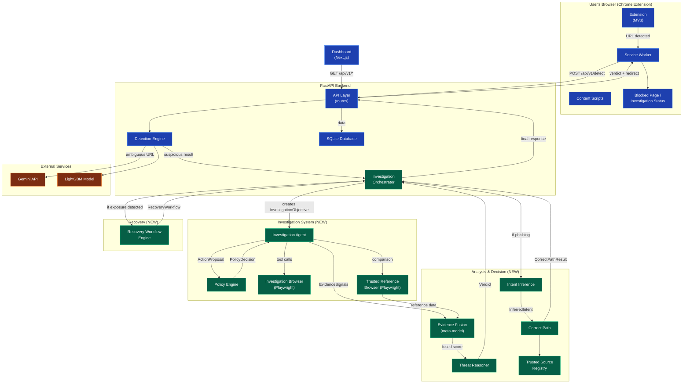
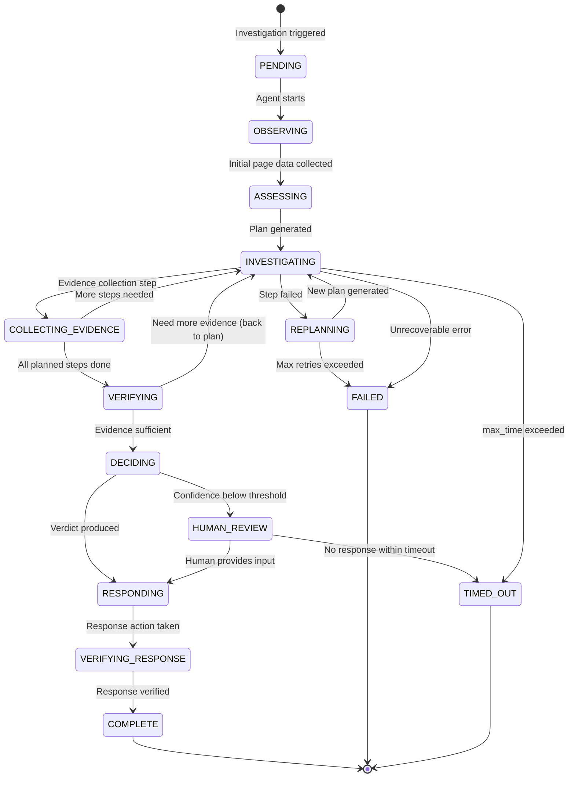

# ClickWise — System Design Document

> **Document:** `docs/planning/02-system-design.md`
> **Status:** BINDING CONTRACT — no sub-PRD may contradict this document.
> **Depends on:** [Delta List](./00-delta-list.md), [Main PRD](./01-main-prd.md)
> **Referenced by:** All sub-PRDs in [`prds/`](./prds/)

---

## 1. Glossary

This is the **terminology lock**. Every module, data object, status value, and enum used anywhere in the project must match these canonical names exactly. Sub-PRD authors are not allowed to invent alternative names.

### 1.1 Modules

| Canonical Name | What It Is | Status |
|---|---|---|
| **Detection Engine** | The ML + heuristic + LLM pipeline that scores a URL's phishing probability. Produces a `DetectionResult`. | EXISTS (being modified) |
| **Investigation Agent** | The autonomous system that opens a suspicious page in an isolated browser context, executes a bounded investigation plan, and collects evidence. Operates via a constrained tool interface — NOT arbitrary browser control. | NEW |
| **Investigation Browser** | A Playwright-controlled, completely isolated Chromium context used by the Investigation Agent to inspect suspicious URLs. Has no user cookies, passwords, payment info, or browsing history. | NEW |
| **Trusted Reference Browser** | A separate Playwright-controlled context used to load the legitimate version of a claimed organization's site for comparison. Kept isolated from the Investigation Browser. | NEW |
| **Policy Engine** | A deterministic (non-ML, non-LLM) layer that sits between the Investigation Agent's action decisions and actual tool execution. Every proposed action passes through the Policy Engine before execution. Enforces the Risk Tier Table (§4). | NEW |
| **Evidence Fusion** | A trained stacked meta-model (logistic regression or gradient-boosted) that combines all evidence signals (ML score, DOM analysis, urgency language, visual similarity, threat intel) into a single calibrated phishing probability. Replaces the hand-tuned weight blending currently in `main.py` L521-533. | NEW (replaces existing) |
| **Threat Reasoner** | The component that takes the Evidence Fusion output and produces a human-readable `Verdict` object — not just a score, but an explanation of why the system reached its conclusion. | NEW |
| **Intent Inference** | Determines the user's original intent from context (search query, message text, URL structure). Outputs an `InferredIntent` object with a confidence score. | NEW |
| **Correct Path** | The mechanism that, given a confirmed phishing verdict and an inferred intent, resolves the legitimate destination and redirects the user there. Uses the Trusted Source Registry hierarchy: curated registry > verified official source > search-based discovery > LLM reasoning. The LLM is never the root of trust. | NEW |
| **Trusted Source Registry** | A curated database mapping organizations to their official domains, login URLs, logo references, and known services. Seeded with 20–50 high-value organizations for the hackathon demo. | NEW |
| **Recovery Workflow Engine** | Provides structured (not LLM-improvised) recovery guidance when the user may have already been exposed. Covers credential exposure and payment exposure flows. Guidance only — never performs autonomous account actions. | NEW |
| **Extension** | The Chrome Extension (MV3) that runs in the user's real browser. Detects navigation, communicates with the Backend, shows warnings/blocked pages, renders investigation status, and displays Correct Path redirects. | EXISTS (being modified) |
| **Backend** | The FastAPI server that orchestrates all backend logic: detection, investigation triggering, evidence collection, verdict generation, and API serving. Currently a 990-line monolith (`main.py`) — will be decomposed into modules. | EXISTS (being modified) |
| **Dashboard** | The Next.js web application that provides a KPI dashboard and (new) Incident Investigation Console. | EXISTS (being extended) |

### 1.2 Data Objects

| Canonical Name | Description |
|---|---|
| **DetectionResult** | Output of the Detection Engine for a single URL. Contains the URL, phishing probability, risk level, heuristic flags, and ML/LLM signal details. |
| **InvestigationObjective** | The structured objective given to the Investigation Agent when it begins work. Contains the target URL, claimed brand, objective steps, and resource bounds (max_steps, max_time, allowed_domains). |
| **ActionProposal** | An action the Investigation Agent wants to perform (e.g., click a button, navigate to a URL). Submitted to the Policy Engine for approval before execution. |
| **PolicyDecision** | The Policy Engine's response to an ActionProposal: `ALLOW`, `BLOCK`, or `REQUIRE_APPROVAL`, with a reason string. |
| **EvidenceSignal** | A single piece of evidence collected during investigation (e.g., "login form detected", "brand mismatch", "urgency language found"). Has a signal name, score (0.0–1.0), confidence, and source module. |
| **EvidenceBundle** | The complete set of EvidenceSignals collected during one investigation, grouped by category. |
| **Verdict** | The final determination: a verdict label (`PHISHING`, `SUSPICIOUS`, `LEGITIMATE`, `INCONCLUSIVE`), a probability score, an evidence list, and a human-readable explanation text. |
| **InferredIntent** | The system's understanding of what the user was trying to do. Contains: inferred organization, inferred task, confidence score, and source (search query / message text / URL structure). |
| **CorrectPathResult** | The output of Correct Path resolution: the legitimate destination URL, the trust source used, and the confidence level. |
| **RecoveryWorkflow** | A structured recovery plan: the exposure type (credential / payment), the affected service, and an ordered list of recovery steps (each with a description, an action type, and an optional URL). |
| **InvestigationTrace** | A timestamped log of every action the Investigation Agent performed, every Policy Engine decision, and every evidence signal collected. Used for observability and the dashboard's agent trace view. |

### 1.3 Enums and Status Values

**`risk_level`** — matches the existing database column in `ScanResult.risk_level`:
```
Low | Medium | High | Critical
```
> Do NOT add new values. The extension's badge color mapping and the dashboard both depend on exactly these four values.

**`verdict_label`** — the Investigation Agent's final determination:
```
PHISHING | SUSPICIOUS | LEGITIMATE | INCONCLUSIVE
```

**`investigation_status`** — lifecycle status of an investigation (see §5 State Machine for transitions):
```
PENDING | OBSERVING | ASSESSING | INVESTIGATING | COLLECTING_EVIDENCE |
VERIFYING | DECIDING | RESPONDING | VERIFYING_RESPONSE | COMPLETE |
REPLANNING | HUMAN_REVIEW | FAILED | TIMED_OUT
```

**`policy_decision`** — Policy Engine's response to an action proposal:
```
ALLOW | BLOCK | REQUIRE_APPROVAL
```

**`risk_tier`** — action risk classification (see §4 Risk Tier Table):
```
OBSERVATION | REVERSIBLE | SENSITIVE | EXTERNAL_EFFECT | FINANCIAL_IRREVERSIBLE
```

**`exposure_type`** — what was exposed before the block:
```
NONE | CREDENTIAL | PAYMENT | PERSONAL_INFO
```

**`trust_source`** — how the legitimate destination was resolved:
```
CURATED_REGISTRY | VERIFIED_OFFICIAL | SEARCH_DISCOVERY | LLM_REASONING
```
> Ordered by trust priority. `CURATED_REGISTRY` is highest trust. `LLM_REASONING` is lowest — never used alone as the basis for redirection.

---

## 2. Module Map

### 2.1 Architecture Diagram



### 2.2 Boundary Classification

| Component | Boundary | Modification Type |
|---|---|---|
| **Extension** | EXISTING | Modified — new UI states for "investigating...", verdict display, Correct Path redirect |
| **Service Worker** | EXISTING | Modified — new message types for investigation status, polling/SSE for verdict |
| **Content Scripts** | EXISTING | Minor changes — new badge states |
| **Blocked Page** | EXISTING | Modified — becomes "Investigation Result" page with verdict + Correct Path |
| **API Layer** | EXISTING | Modified — new routes for investigation trigger/poll, de-monolithed from main.py |
| **Detection Engine** | EXISTING | Modified — extracted from main.py, retrained model, evidence fusion replaces hand-tuning |
| **SQLite Database** | EXISTING | Modified — new tables for investigations, evidence, trusted sources |
| **Dashboard** | EXISTING | Extended — new Incident Investigation Console alongside existing KPI view |
| **Investigation Orchestrator** | **NEW** | Coordinates the entire investigation lifecycle |
| **Investigation Agent** | **NEW** | Autonomous browser agent with constrained tool interface |
| **Policy Engine** | **NEW** | Deterministic safety layer |
| **Investigation Browser** | **NEW** | Isolated Playwright context for suspicious sites |
| **Trusted Reference Browser** | **NEW** | Isolated Playwright context for legitimate sites |
| **Evidence Fusion** | **NEW** | Trained meta-model (replaces existing hand-tuned blending) |
| **Threat Reasoner** | **NEW** | Explainable verdict generation |
| **Intent Inference** | **NEW** | User intent extraction |
| **Correct Path** | **NEW** | Legitimate destination resolution |
| **Trusted Source Registry** | **NEW** | Organization-to-domain mapping database |
| **Recovery Workflow Engine** | **NEW** | Structured recovery guidance |

---

## 3. Data Contracts

Every boundary crossing between modules is defined here. Sub-PRDs consume these contracts — they do not define their own versions.

### 3.1 Extension → Backend: Detection Request

**Endpoint:** `POST /api/v1/detect`
**Direction:** Extension Service Worker → Backend API Layer
**When:** User navigates to a new URL (main frame)

```jsonc
// REQUEST
{
  "url": "https://sbi-login-verify.example.com/kyc",
  "context": {                          // NEW — optional context for intent inference
    "referrer": "https://google.com/search?q=sbi+net+banking",
    "search_query": "sbi net banking",  // extracted from referrer if search engine
    "message_text": null                // if URL came from a message/SMS
  }
}
```

```jsonc
// RESPONSE (extended from existing DetectionResponse)
{
  "url": "https://sbi-login-verify.example.com/kyc",
  "is_phishing": true,
  "confidence_score": 0.82,
  "max_risk_score": 0.82,
  "risk_level": "High",                    // enum: Low | Medium | High | Critical
  "heuristics": {
    "ip_address_host": false,
    "too_long": false,
    "suspicious_chars": true,
    "ai_flagged": true,
    "ai_signals": ["TYPOSQUATTING", "SUSPICIOUS_TLD"]
  },
  "investigation": {                       // NEW — null if no investigation triggered
    "investigation_id": "inv_a1b2c3d4",
    "status": "PENDING",                   // enum: see §1.3 investigation_status
    "poll_url": "/api/v1/investigation/inv_a1b2c3d4"
  }
}
```

**Compatibility note:** The existing `DetectionResponse` fields (`url`, `is_phishing`, `confidence_score`, `max_risk_score`, `risk_level`, `heuristics`) are preserved exactly. The new `investigation` field is additive — the extension checks for its presence and falls back to the existing block-only behavior if absent.

### 3.2 Extension ↔ Backend: Investigation Polling

**Endpoint:** `GET /api/v1/investigation/{investigation_id}`
**Direction:** Extension Service Worker → Backend (polled every 2 seconds while status is not terminal)
**When:** An investigation has been triggered and the extension is waiting for a result

```jsonc
// RESPONSE (while investigating)
{
  "investigation_id": "inv_a1b2c3d4",
  "status": "INVESTIGATING",              // current state machine state
  "started_at": "2026-08-17T01:15:00Z",
  "elapsed_seconds": 8,
  "current_step": "Inspecting login form on suspicious page",
  "steps_completed": 5,
  "steps_total": 10                        // bounded plan step count
}
```

```jsonc
// RESPONSE (investigation complete)
{
  "investigation_id": "inv_a1b2c3d4",
  "status": "COMPLETE",
  "started_at": "2026-08-17T01:15:00Z",
  "completed_at": "2026-08-17T01:15:12Z",
  "elapsed_seconds": 12,

  "verdict": {
    "label": "PHISHING",                   // enum: PHISHING | SUSPICIOUS | LEGITIMATE | INCONCLUSIVE
    "probability": 0.96,
    "explanation": "This site is impersonating State Bank of India. The login page closely matches the real SBI portal but is hosted on a different domain (sbi-login-verify.example.com instead of onlinesbi.sbi.co.in). A password and OTP field were detected. The form submits data to a suspicious external endpoint.",
    "evidence": [
      {"signal": "brand_impersonation", "score": 0.95, "detail": "Claims to be SBI, domain does not match"},
      {"signal": "credential_form", "score": 0.90, "detail": "Password + OTP fields detected"},
      {"signal": "domain_mismatch", "score": 0.98, "detail": "sbi-login-verify.example.com ≠ onlinesbi.sbi.co.in"},
      {"signal": "urgency_language", "score": 0.85, "detail": "\"blocked today\", \"immediately\""},
      {"signal": "visual_similarity", "score": 0.88, "detail": "Login page layout 88% similar to real SBI"}
    ]
  },

  "correct_path": {                        // null if verdict is LEGITIMATE or INCONCLUSIVE
    "destination_url": "https://onlinesbi.sbi.co.in",
    "organization": "State Bank of India",
    "service": "Online Banking",
    "trust_source": "CURATED_REGISTRY",    // enum: see §1.3 trust_source
    "confidence": 0.94,
    "auto_redirect": true                  // true if confidence >= 0.80, false = ask user
  },

  "recovery": {                            // null if no exposure detected
    "exposure_type": "NONE",               // enum: NONE | CREDENTIAL | PAYMENT | PERSONAL_INFO
    "workflow": null
  },

  "trace_url": "/api/v1/investigation/inv_a1b2c3d4/trace"
}
```

### 3.3 Backend → Investigation Agent: Investigation Objective

**Internal interface** (Python function call, not HTTP)
**Direction:** Investigation Orchestrator → Investigation Agent
**When:** Detection Engine flags a URL as suspicious and triggers investigation

```jsonc
// InvestigationObjective
{
  "investigation_id": "inv_a1b2c3d4",
  "target_url": "https://sbi-login-verify.example.com/kyc",
  "claimed_brand": "SBI",                  // inferred from URL/page content, may be null
  "user_context": {
    "search_query": "sbi net banking",
    "referrer": "https://google.com/search?q=sbi+net+banking",
    "message_text": null
  },
  "objective_steps": [
    "identify_impersonation",
    "detect_credential_collection",
    "inspect_redirects",
    "compare_trusted_branding",
    "determine_user_safe_destination"
  ],
  "bounds": {
    "max_steps": 15,
    "max_time_seconds": 30,
    "max_browser_contexts": 2,             // investigation + trusted reference
    "max_network_requests": 50,
    "allowed_domains": [
      "sbi-login-verify.example.com",      // the suspicious target
      "onlinesbi.sbi.co.in",               // the suspected real site
      "sbi.co.in"                          // parent domain
    ],
    "prohibited_actions": [
      "submit_credentials",
      "submit_payment",
      "download_executable"
    ]
  }
}
```

### 3.4 Investigation Agent → Policy Engine: Action Proposal & Decision

**Internal interface** (Python function call)
**Direction:** Investigation Agent → Policy Engine (before every tool call)

```jsonc
// ActionProposal
{
  "investigation_id": "inv_a1b2c3d4",
  "action_type": "click",                  // navigate | click | type | scroll | screenshot | inspect_dom | extract_forms | extract_links | inspect_redirects | inspect_network | get_page_text | back
  "risk_tier": "REVERSIBLE",               // agent's self-assessment, Policy Engine verifies
  "parameters": {
    "selector": "button#loginBtn",
    "context": "investigation_browser"      // investigation_browser | trusted_reference_browser
  },
  "rationale": "Clicking login button to observe form submission behavior"
}
```

```jsonc
// PolicyDecision
{
  "decision": "ALLOW",                     // ALLOW | BLOCK | REQUIRE_APPROVAL
  "verified_risk_tier": "REVERSIBLE",      // Policy Engine's own assessment (may differ from agent's)
  "reason": "Click action in sandboxed investigation browser, no credential fields populated",
  "conditions": []                          // optional constraints, e.g. ["do_not_submit_form"]
}
```

### 3.5 Investigation Agent → Evidence Fusion: Evidence Signals

**Internal interface** (Python function call)
**Direction:** Investigation Agent → Evidence Fusion meta-model

```jsonc
// EvidenceBundle (input to Evidence Fusion)
{
  "investigation_id": "inv_a1b2c3d4",
  "signals": [
    {"name": "ml_url_score",        "score": 0.82, "confidence": 0.95, "source": "detection_engine"},
    {"name": "dom_login_form",      "score": 0.90, "confidence": 0.99, "source": "investigation_agent"},
    {"name": "dom_otp_field",       "score": 0.85, "confidence": 0.99, "source": "investigation_agent"},
    {"name": "urgency_language",    "score": 0.80, "confidence": 0.85, "source": "investigation_agent"},
    {"name": "brand_impersonation", "score": 0.95, "confidence": 0.90, "source": "investigation_agent"},
    {"name": "domain_mismatch",     "score": 0.98, "confidence": 0.99, "source": "investigation_agent"},
    {"name": "visual_similarity",   "score": 0.88, "confidence": 0.80, "source": "investigation_agent"},
    {"name": "redirect_chain",      "score": 0.30, "confidence": 0.70, "source": "investigation_agent"},
    {"name": "threat_intel_match",  "score": 0.00, "confidence": 0.50, "source": "threat_intel"}
  ]
}
```

```jsonc
// EvidenceFusionResult (output)
{
  "phishing_probability": 0.96,
  "calibrated": true,                      // whether the meta-model is trained vs falling back
  "feature_importances": {                  // for explainability
    "domain_mismatch": 0.28,
    "brand_impersonation": 0.22,
    "dom_login_form": 0.18,
    "ml_url_score": 0.12,
    "visual_similarity": 0.10,
    "urgency_language": 0.06,
    "dom_otp_field": 0.04
  }
}
```

### 3.6 Evidence Fusion → Threat Reasoner: Verdict Generation

**Internal interface** (Python function call)
**Direction:** Evidence Fusion → Threat Reasoner

```jsonc
// Input: EvidenceFusionResult + EvidenceBundle (both passed)
// Output: Verdict
{
  "label": "PHISHING",
  "probability": 0.96,
  "explanation": "This site is impersonating State Bank of India. The login page closely matches the real SBI portal but is hosted on a different domain (sbi-login-verify.example.com instead of onlinesbi.sbi.co.in). A password and OTP field were detected. The form submits data to a suspicious external endpoint.",
  "evidence": [
    {"signal": "brand_impersonation", "score": 0.95, "detail": "Claims to be SBI, domain does not match"},
    {"signal": "credential_form", "score": 0.90, "detail": "Password + OTP fields detected"},
    {"signal": "domain_mismatch", "score": 0.98, "detail": "sbi-login-verify.example.com ≠ onlinesbi.sbi.co.in"},
    {"signal": "urgency_language", "score": 0.85, "detail": "\"blocked today\", \"immediately\""},
    {"signal": "visual_similarity", "score": 0.88, "detail": "Login page layout 88% similar to real SBI"}
  ],
  "attack_type": "credential_phishing",     // credential_phishing | payment_phishing | brand_impersonation | redirect_attack | social_engineering
  "claimed_organization": "State Bank of India",
  "confidence_tier": "HIGH"                  // LOW (< 0.5) | MEDIUM (0.5-0.8) | HIGH (> 0.8)
}
```

### 3.7 Threat Reasoner → Intent Inference / Correct Path

**Internal interface** (Python function call)
**Direction:** Investigation Orchestrator triggers Intent Inference when Verdict.label is `PHISHING` or `SUSPICIOUS`

```jsonc
// Intent Inference Input
{
  "verdict": { /* Verdict object from §3.6 */ },
  "user_context": {
    "search_query": "sbi net banking",
    "referrer": "https://google.com/search?q=sbi+net+banking",
    "message_text": null,
    "target_url": "https://sbi-login-verify.example.com/kyc"
  }
}
```

```jsonc
// InferredIntent Output
{
  "organization": "State Bank of India",
  "task": "online banking login",
  "confidence": 0.94,
  "source": "search_query",                // search_query | message_text | url_structure | llm_inference
  "reasoning": "User searched for 'sbi net banking' — intent is to access SBI online banking"
}
```

```jsonc
// Correct Path Resolution Input
{
  "inferred_intent": { /* InferredIntent from above */ },
  "claimed_organization": "State Bank of India"
}
```

```jsonc
// CorrectPathResult Output
{
  "destination_url": "https://onlinesbi.sbi.co.in",
  "organization": "State Bank of India",
  "service": "Online Banking",
  "trust_source": "CURATED_REGISTRY",
  "confidence": 0.94,
  "auto_redirect": true                    // true if confidence >= 0.80
}
```

**Auto-redirect threshold:**
- `confidence >= 0.80` → auto-redirect (open the legitimate site directly)
- `confidence >= 0.50 && < 0.80` → ask the user: "Were you trying to access [org]? [Go to real site] / [Cancel]"
- `confidence < 0.50` → do NOT redirect. Show verdict only. Say: "This site appears suspicious. We couldn't determine where you were trying to go."

> **Hard rule:** When uncertain, ask instead of guessing the destination. A wrong redirect is worse than no redirect.

### 3.8 Backend → Extension: Communication Pattern

**Pattern:** Polling (not WebSocket)
**Rationale:** The extension already uses a polling pattern for blocklist sync ([service-worker.js L130](../../../extension-clean/src/background/service-worker.js)). Adding WebSocket support adds complexity with minimal benefit for a hackathon timeline. Polling at 2-second intervals during active investigations is acceptable.

**Flow:**
1. Extension sends `POST /api/v1/detect` → receives `DetectionResult` with optional `investigation` field
2. If `investigation` is present and `status` is `PENDING`:
   - Extension shows "Investigating..." UI state (spinner + progress text)
   - Extension begins polling `GET /api/v1/investigation/{id}` every 2 seconds
3. When status becomes terminal (`COMPLETE`, `FAILED`, `TIMED_OUT`):
   - Extension stops polling
   - If `COMPLETE`: renders verdict, shows Correct Path if available
   - If `FAILED`/`TIMED_OUT`: falls back to existing block behavior based on initial DetectionResult

### 3.9 Recovery Workflow Contract

**Internal interface** (Python function call)
**Direction:** Investigation Orchestrator → Recovery Workflow Engine
**When:** The user may have entered credentials or payment info before the system intervened

```jsonc
// Recovery Input
{
  "exposure_type": "CREDENTIAL",           // CREDENTIAL | PAYMENT | PERSONAL_INFO
  "affected_service": "State Bank of India",
  "service_category": "banking",           // banking | government | ecommerce | social_media | email | other
  "official_url": "https://onlinesbi.sbi.co.in",
  "fields_exposed": ["password", "otp"]    // what the user likely entered
}
```

```jsonc
// RecoveryWorkflow Output
{
  "exposure_type": "CREDENTIAL",
  "severity": "HIGH",
  "steps": [
    {
      "order": 1,
      "title": "Change your password immediately",
      "description": "Go to the official SBI website and change your net banking password.",
      "action_type": "navigate",            // navigate | instruct | contact
      "url": "https://onlinesbi.sbi.co.in"
    },
    {
      "order": 2,
      "title": "Revoke active sessions",
      "description": "Log out of all active sessions from your SBI account settings.",
      "action_type": "instruct",
      "url": null
    },
    {
      "order": 3,
      "title": "Enable Multi-Factor Authentication",
      "description": "If not already enabled, turn on 2FA/MFA in your account security settings.",
      "action_type": "instruct",
      "url": null
    },
    {
      "order": 4,
      "title": "Review recent account activity",
      "description": "Check your account statement for any unauthorized transactions in the last 24 hours.",
      "action_type": "instruct",
      "url": null
    },
    {
      "order": 5,
      "title": "Contact official support if needed",
      "description": "If you notice unauthorized activity, call SBI's official helpline: 1800-11-2211 (toll-free).",
      "action_type": "contact",
      "url": null
    }
  ]
}
```

---

## 4. Risk Tier Table

This table is the **canonical reference** for action risk classification. The Policy Engine PRD and Investigation Agent PRD both consume this table — neither may redefine it.

| Tier | Name | Examples | Policy |
|---|---|---|---|
| **0** | `OBSERVATION` | `screenshot`, `inspect_dom`, `get_page_text`, `extract_links`, `extract_forms`, URL inspection | **Automatically allowed** — always |
| **1** | `REVERSIBLE` | `scroll`, `back`, `navigate` (within allowed_domains), open new tab, click non-form elements | **Automatically allowed** inside sandbox |
| **2** | `SENSITIVE` | Interacting with form fields (without submitting), downloading files (quarantined), executing page JavaScript observation | **Restricted** — allowed only in Investigation Browser, logged, with rationale |
| **3** | `EXTERNAL_EFFECT` | Submitting non-credential forms, sending messages, changing settings on the investigated page | **Human approval required** — or BLOCK if no human available |
| **4** | `FINANCIAL_IRREVERSIBLE` | Submitting credentials, submitting payment info, making purchases, account deletion, financial transfers | **Never autonomous** — always BLOCK, no override |

### Classification Rules

1. The Investigation Agent self-classifies each action's risk tier in its `ActionProposal`
2. The Policy Engine independently verifies the classification based on the action type and context
3. If the Policy Engine's classification is **higher** than the agent's, the Policy Engine's classification wins
4. If the Policy Engine's classification is **lower**, the agent's self-assessment wins (conservative default)
5. Tier 4 actions are **hardcoded BLOCK** — no LLM reasoning, no override, no exception

### Domain Restrictions

- The Investigation Agent may only navigate to domains listed in the `InvestigationObjective.bounds.allowed_domains`
- Any navigation outside this list is automatically `BLOCK`ed by the Policy Engine
- The allowed_domains list is set by the Investigation Orchestrator at investigation start and cannot be modified by the agent during investigation

---

## 5. Investigation State Machine

### 5.1 State Diagram



### 5.2 State Definitions

| State | Description | Entry Condition | Exit Condition |
|---|---|---|---|
| `PENDING` | Investigation created but not yet started | Detection flags URL as suspicious | Agent process begins |
| `OBSERVING` | Agent loads the target page and performs Level 0 (observation) actions | Agent starts | Initial screenshot, DOM, page text collected |
| `ASSESSING` | Agent analyzes initial observations and generates a bounded investigation plan | Initial data collected | Plan generated with step count ≤ `max_steps` |
| `INVESTIGATING` | Agent executes investigation plan steps (each step = one tool call through Policy Engine) | Plan exists | All steps done OR step fails |
| `COLLECTING_EVIDENCE` | After each investigation step, agent records the evidence signal | Step completes successfully | Evidence signal added to EvidenceBundle |
| `REPLANNING` | A step failed (element not found, page changed, etc.) — agent generates a revised plan | Step failure | New plan generated OR max retries (3) exceeded |
| `VERIFYING` | Agent reviews collected evidence for completeness | All planned steps done | Evidence sufficient for verdict OR gaps identified |
| `DECIDING` | Evidence Fusion + Threat Reasoner produce a Verdict | Evidence verified | Verdict produced |
| `HUMAN_REVIEW` | Verdict confidence is below threshold (< 0.50) — system asks for human input | Low-confidence verdict | Human responds or timeout (60 seconds) |
| `RESPONDING` | System takes the response action: block, redirect (Correct Path), or allow | Verdict + (optional) human input received | Response action executed |
| `VERIFYING_RESPONSE` | System confirms the response was delivered correctly (blocked page shown, redirect loaded) | Response action taken | Confirmation received |
| `COMPLETE` | Investigation finished successfully | Response verified | Terminal state |
| `FAILED` | Investigation encountered an unrecoverable error or exceeded max retries | Error or retry limit | Terminal state |
| `TIMED_OUT` | Investigation exceeded `max_time_seconds` | Timer expired | Terminal state |

### 5.3 Invariants

1. **Every state transition is logged** in the `InvestigationTrace`
2. **The state can only move forward or to a failure state** — no backwards transitions except `INVESTIGATING ↔ COLLECTING_EVIDENCE` (which is the core loop) and `INVESTIGATING → REPLANNING → INVESTIGATING` (retry loop, max 3)
3. **Max total wall time:** 30 seconds (configurable via `InvestigationObjective.bounds.max_time_seconds`)
4. **Max total steps:** 15 (configurable via `InvestigationObjective.bounds.max_steps`)
5. **Terminal states:** `COMPLETE`, `FAILED`, `TIMED_OUT` — once reached, no further actions
6. **If investigation fails or times out,** the system falls back to the initial `DetectionResult` for its block/allow decision — the user is never left in limbo

---

## 6. Current vs Target State

*(Formatted from [Delta List](./00-delta-list.md) §7)*

| # | Capability | Status | Evidence | Owning Sub-PRD |
|---|---|---|---|---|
| 1 | URL Detection (LightGBM ML) | ✅ EXISTS | `main.py` L94-228 | [Detection ML](./prds/03a-detection-ml.md) |
| 2 | URL Heuristics | ✅ EXISTS | `main.py` L494-507 | [Detection ML](./prds/03a-detection-ml.md) |
| 3 | LLM Verification (Gemini) | ✅ EXISTS | `main.py` L562-583, `llm.py` | [Detection ML](./prds/03a-detection-ml.md) |
| 4 | Score Blending | ⚠️ PARTIAL | `main.py` L521-533 — hand-tuned, not trained | [Detection ML](./prds/03a-detection-ml.md) |
| 5 | Keyword Blocklist | ✅ EXISTS | `main.py` L403-492 | [Backend API](./prds/03b-backend-api.md) |
| 6 | Trusted Domain Whitelist | ✅ EXISTS | `main.py` L44-84, L116-139 | [Backend API](./prds/03b-backend-api.md) |
| 7 | Chrome Extension (MV3) | ✅ EXISTS | `extension-clean/` | [Extension](./prds/03c-extension.md) |
| 8 | Block Page | ✅ EXISTS | `blocked.html`, `service-worker.js` L397-403 | [Extension](./prds/03c-extension.md) |
| 9 | KPI Dashboard | ✅ EXISTS | `my-app/app/dashboard/` | [Dashboard](./prds/03d-dashboard-ui.md) |
| 10 | AI Chat (Sentinel AI) | ✅ EXISTS | `llm.py`, `main.py` L812 | [Dashboard](./prds/03d-dashboard-ui.md) |
| 11 | Investigation Agent | ❌ DOES NOT EXIST | — | [Investigation Agent](./prds/03e-investigation-agent.md) |
| 12 | Investigation Browser | ❌ DOES NOT EXIST | — | [Investigation Agent](./prds/03e-investigation-agent.md) |
| 13 | Trusted Reference Browser | ❌ DOES NOT EXIST | — | [Investigation Agent](./prds/03e-investigation-agent.md) |
| 14 | Policy Engine | ❌ DOES NOT EXIST | — | [Policy Engine](./prds/03f-policy-engine.md) |
| 15 | Action Risk Classification | ❌ DOES NOT EXIST | — | [Policy Engine](./prds/03f-policy-engine.md) |
| 16 | Agent State Machine | ❌ DOES NOT EXIST | — | [Investigation Agent](./prds/03e-investigation-agent.md) |
| 17 | Bounded Investigation Planner | ❌ DOES NOT EXIST | — | [Investigation Agent](./prds/03e-investigation-agent.md) |
| 18 | Evidence Fusion (meta-model) | ❌ DOES NOT EXIST | — | [Detection ML](./prds/03a-detection-ml.md) |
| 19 | Explainable Verdict | ❌ DOES NOT EXIST | — | [Detection ML](./prds/03a-detection-ml.md) |
| 20 | Intent Inference | ❌ DOES NOT EXIST | — | [Intent & Correct Path](./prds/03g-intent-correct-path.md) |
| 21 | Correct Path Redirection | ❌ DOES NOT EXIST | — | [Intent & Correct Path](./prds/03g-intent-correct-path.md) |
| 22 | Trusted Source Registry | ❌ DOES NOT EXIST | — | [Intent & Correct Path](./prds/03g-intent-correct-path.md) |
| 23 | Recovery Workflow Engine | ❌ DOES NOT EXIST | — | [Recovery Workflow](./prds/03h-recovery-workflow.md) |
| 24 | Visual/Logo Similarity | ❌ DOES NOT EXIST | — | [Detection ML](./prds/03a-detection-ml.md) |
| 25 | Evidence Graph | ❌ DOES NOT EXIST | — | [Dashboard](./prds/03d-dashboard-ui.md) |
| 26 | Credential-Harvesting Detection | ❌ DOES NOT EXIST | — | [Investigation Agent](./prds/03e-investigation-agent.md) |
| 27 | Social Engineering Analysis | ⚠️ PARTIAL | Client-side triggers only (`service-worker.js` L240-258), no backend endpoint | [Detection ML](./prds/03a-detection-ml.md) |
| 28 | Prompt Injection Defense | ❌ DOES NOT EXIST | — | [Policy Engine](./prds/03f-policy-engine.md) |
| 29 | Incident Investigation Console | ❌ DOES NOT EXIST | — | [Dashboard](./prds/03d-dashboard-ui.md) |
| 30 | Agent Trace / Observability | ❌ DOES NOT EXIST | — | [Investigation Agent](./prds/03e-investigation-agent.md) |
| 31 | Human-in-the-Loop Approval | ❌ DOES NOT EXIST | — | [Policy Engine](./prds/03f-policy-engine.md) |
| 32 | Family Protection Notifications | ❌ DOES NOT EXIST | — | Upgrade (out of Core) |
| 33 | Threat Intelligence Feed | ❌ DOES NOT EXIST | — | Upgrade (out of Core) |

---

*Next: Sub-PRDs in [`prds/`](./prds/) — one at a time, starting with [Detection & ML](./prds/03a-detection-ml.md)*
