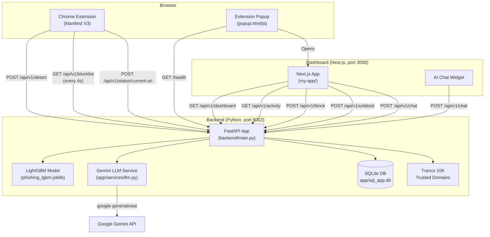
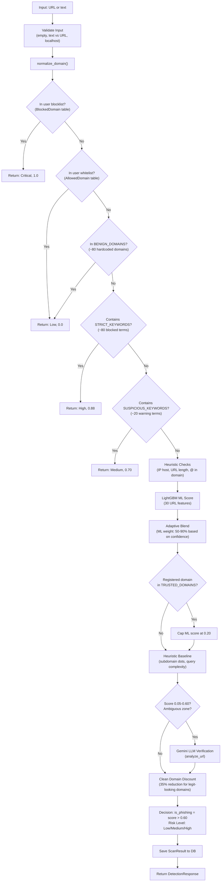
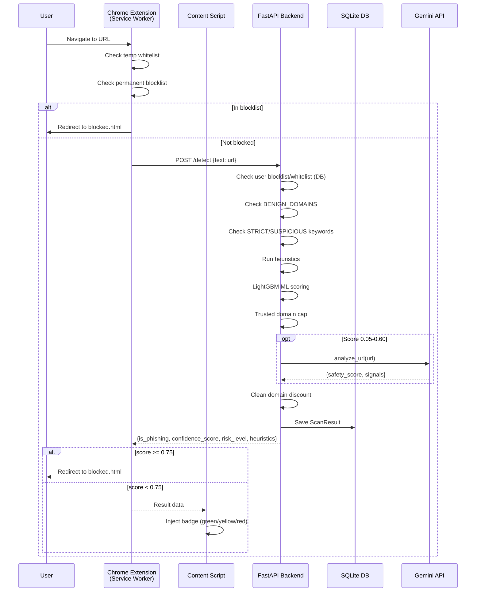
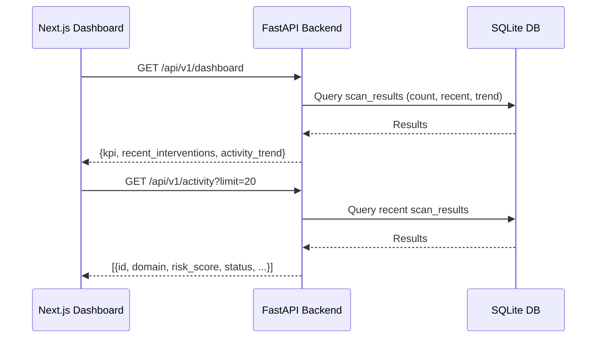

# SecureSentinel — Present Technical State

> **Purpose:** Canonical reference for the full codebase. Designed so that any AI agent or developer can read this single file and understand what exists, how it connects, what works, and what doesn't — before making changes.
>
> **Last updated:** 2026-08-17  
> **Repo:** `karthik5033/Secure-Sentinel` (formerly `Phishing-detector`)

---

## Table of Contents

- [1. Project Identity](#1-project-identity)
- [2. High-Level Architecture](#2-high-level-architecture)
- [3. Directory Map](#3-directory-map)
- [4. Backend (Python / FastAPI)](#4-backend-python--fastapi)
  - [4.1 Entrypoint & Startup](#41-entrypoint--startup)
  - [4.2 API Route Table](#42-api-route-table)
  - [4.3 Detection Pipeline (Core Logic)](#43-detection-pipeline-core-logic)
  - [4.4 Database Schema](#44-database-schema)
  - [4.5 LLM Service](#45-llm-service)
  - [4.6 Dependencies](#46-dependencies)
- [5. ML Pipeline](#5-ml-pipeline)
  - [5.1 Active Model](#51-active-model)
  - [5.2 Feature Set](#52-feature-set)
  - [5.3 Training Data](#53-training-data)
  - [5.4 Other Models (Unused)](#54-other-models-unused)
- [6. Chrome Extension (`extension-clean/`)](#6-chrome-extension-extension-clean)
  - [6.1 Manifest & Permissions](#61-manifest--permissions)
  - [6.2 Content Scripts](#62-content-scripts)
  - [6.3 Service Worker](#63-service-worker)
  - [6.4 Blocked Page](#64-blocked-page)
  - [6.5 Popup](#65-popup)
- [7. Frontend Dashboard (`my-app/`)](#7-frontend-dashboard-my-app)
  - [7.1 Tech Stack](#71-tech-stack)
  - [7.2 Route Map](#72-route-map)
  - [7.3 Key Components](#73-key-components)
  - [7.4 API Client Layer](#74-api-client-layer)
- [8. Data Flow Diagrams](#8-data-flow-diagrams)
- [9. Configuration & Environment](#9-configuration--environment)
- [10. Dead Code & Unused Modules](#10-dead-code--unused-modules)
- [11. Known Issues & Technical Debt](#11-known-issues--technical-debt)
- [12. Scripts Reference](#12-scripts-reference)

---

## 1. Project Identity

| Property | Value |
|---|---|
| **Name** | SecureSentinel |
| **What it does** | Real-time phishing URL detection system with a Chrome extension, Python ML backend, and Next.js dashboard |
| **Components** | 3 — Chrome Extension, FastAPI Backend, Next.js Dashboard |
| **ML Model** | LightGBM classifier (URL structural features) |
| **AI Integration** | Google Gemini (via `google-generativeai`) for LLM-assisted URL verification and chat |
| **Database** | SQLite via SQLAlchemy (`backend/app/sql_app.db`) |
| **Ports** | Backend: `8002`, Dashboard: `3000` |
| **Python version** | 3.13+ (from hardcoded path) |
| **Node version** | Next.js 16.1.0, React 19.2.3 |

---

## 2. High-Level Architecture



---

## 3. Directory Map

```
DTLshit/                              # Project root
├── .env.local                        # GEMINI_API_KEY (gitignored, but present on disk)
├── .gitignore
├── README.md                         # Project README (36 KB)
├── issues.md                         # Full audit report (61 issues)
├── start_server_v3.py                # ★ MAIN ENTRYPOINT — runs backend on port 8002
├── run_backend.bat                   # Windows bat script (hardcoded Python path)
│
├── backend/                          # Python backend
│   ├── main.py                       # ★ THE LIVE SERVER (990 lines, monolith)
│   ├── requirements.txt              # 11 unpinned dependencies
│   ├── sql_app.db                    # Stale/duplicate DB (1.3 MB)
│   ├── verify_module3.py             # One-off verification script
│   ├── app/
│   │   ├── __init__.py
│   │   ├── database.py               # ★ SQLAlchemy engine + session (sql_app.db)
│   │   ├── models.py                 # ★ ORM models: ScanResult, BlockedDomain, AllowedDomain
│   │   ├── sql_app.db                # ★ LIVE DATABASE (2.4 MB)
│   │   └── services/
│   │       ├── llm.py                # ★ Gemini LLM service (chat + URL analysis)
│   │       ├── database.py           # ✗ DEAD — parallel unused DB (sentinel.db)
│   │       ├── impersonation.py      # ✗ DEAD — brand impersonation detector
│   │       ├── inference.py          # ✗ DEAD — baseline model inference
│   │       ├── telemetry.py          # ✗ DEAD — disabled fake data generator
│   │       └── temporal.py           # ✗ DEAD — temporal risk analysis
│   ├── data/                         # Backend-local data (gitignored)
│   └── scripts/                      # Backend-specific scripts
│
├── extension-clean/                  # Chrome Extension (Manifest V3)
│   ├── manifest.json                 # Extension manifest (v3.0.0)
│   ├── popup.html                    # Extension popup UI
│   ├── popup.js                      # Popup logic
│   ├── blocked.html                  # Block page template
│   ├── blocked.css                   # Block page styles
│   ├── blocked.js                    # Block page logic (proceed/go-back)
│   ├── icons/                        # Extension icons (16/48/128)
│   └── src/
│       ├── background/
│       │   └── service-worker.js     # ★ Service worker (blocking, cache, sync)
│       └── content/
│           ├── content.js            # ★ Link scanner + badge injection
│           ├── dialog-interceptor.js # Intercepts alert/confirm/prompt
│           ├── dom-popup-scanner.js  # Detects suspicious DOM overlays
│           └── ai-dlp.js            # PII detection on AI chat sites
│
├── my-app/                           # Next.js Dashboard
│   ├── package.json                  # Next 16.1.0 + React 19.2.3 + Tailwind 4
│   ├── app/                          # App Router pages
│   │   ├── layout.tsx                # Root layout (Geist font, AI chat widget, header)
│   │   ├── page.tsx                  # Landing page (Hero + Features + ThreatMap)
│   │   ├── globals.css               # Global styles (Tailwind)
│   │   ├── dashboard/                # Dashboard section
│   │   │   ├── layout.tsx            # Sidebar + main content layout
│   │   │   ├── page.tsx              # ★ Main dashboard (KPIs, activity, chart)
│   │   │   ├── activity/page.tsx     # Activity log page
│   │   │   ├── controls/page.tsx     # Controls page
│   │   │   └── privacy/page.tsx      # Privacy settings page
│   │   ├── analyze/page.tsx          # Message analysis page
│   │   ├── blocked/page.tsx          # Blocked site info page
│   │   ├── features/                 # Feature showcase pages (6 features)
│   │   │   ├── behavioral-baseline/
│   │   │   ├── cognitive-shield/
│   │   │   ├── neural-detection/
│   │   │   ├── quantum-defense/
│   │   │   ├── sentinel-mesh/
│   │   │   └── temporal-analysis/
│   │   ├── architecture/page.tsx     # Architecture documentation page
│   │   ├── docs/page.tsx             # Documentation page
│   │   ├── get-started/page.tsx      # Getting started page
│   │   ├── how-it-works/page.tsx     # How it works page
│   │   ├── install/page.tsx          # Installation guide page
│   │   ├── login/page.tsx            # Login page (no auth backend)
│   │   └── test/page.tsx             # Test page
│   ├── components/
│   │   ├── ExplanationPanel.tsx      # Risk explanation component
│   │   ├── RiskMeter.tsx             # Risk gauge component
│   │   ├── ai/AiChatWidget.tsx       # ★ Floating AI chat widget
│   │   ├── dashboard/
│   │   │   └── activity-chart.tsx    # Activity trend chart
│   │   ├── features/
│   │   │   └── QuantumDefense.tsx    # Quantum defense feature component
│   │   ├── landing/
│   │   │   ├── header.tsx            # ★ Global floating header/nav
│   │   │   ├── hero-section.tsx      # Landing hero
│   │   │   ├── features-4.tsx        # Features grid
│   │   │   ├── threat-map.tsx        # Animated threat map
│   │   │   ├── integrations-7.tsx    # Integrations section
│   │   │   ├── logo.tsx              # Logo component
│   │   │   └── logos.tsx             # Brand logos
│   │   └── ui/                       # Reusable UI primitives (shadcn-style)
│   │       ├── badge.tsx
│   │       ├── button.tsx
│   │       ├── card.tsx
│   │       ├── infinite-slider.tsx
│   │       ├── progress.tsx
│   │       └── progressive-blur.tsx
│   ├── lib/
│   │   ├── api.ts                    # API client (analyzeMessage)
│   │   ├── constants.ts              # API_BASE_URL constant
│   │   └── utils.ts                  # cn() utility (tailwind-merge)
│   └── types/
│       └── analysis.ts               # TypeScript interfaces
│
├── models/                           # ML model artifacts
│   ├── phishing_lgbm.joblib          # ★ ACTIVE — LightGBM model (6.5 MB)
│   ├── model_metadata.json           # ★ Feature list + threshold + metrics
│   ├── model_baseline.joblib         # ✗ Unused baseline model (12 KB)
│   ├── model_enhanced.joblib         # ✗ Unused enhanced model (32 MB)
│   ├── model_scalable.joblib         # ✗ Unused scalable model (643 KB)
│   ├── vectorizer_baseline.joblib    # ✗ Unused vectorizer
│   ├── vectorizer_enhanced.joblib    # ✗ Unused vectorizer
│   └── vectorizer_scalable.joblib    # ✗ Unused vectorizer
│
├── ext_data/                         # External training/reference data
│   ├── features_final.csv            # Processed features (42 MB)
│   ├── training_final.csv            # Final training set (31 MB)
│   ├── tranco_10k.csv                # ★ Top 10K trusted domains (loaded at startup)
│   └── ... (13 files total)
│
├── data/                             # Data directory (gitignored)
│   ├── processed/
│   └── raw/
│
├── notebooks/                        # Jupyter notebooks
│   ├── 01_explore_data.ipynb
│   ├── 02_preprocess.ipynb
│   ├── 03_train_model.ipynb
│   └── 04_evaluate.ipynb
│
└── scripts/                          # Utility scripts
    ├── train_lgbm.py                 # ★ Train LightGBM model
    ├── train_lgbm_clean.py           # Clean training variant
    ├── eval_lgbm.py                  # Evaluate model performance
    ├── train_baseline.py             # Train baseline model
    ├── train_enhanced.py             # Train enhanced model
    ├── train_scalable.py             # Train scalable model
    ├── train_transformers.py         # Transformer-based training (experimental)
    ├── generate_data.py              # Generate training data
    ├── generate_ai_data.py           # Generate data with AI
    ├── generate_hard_negatives.py    # Generate hard negative samples
    ├── generate_risky_urls.py        # Generate risky URL samples
    ├── process_data.py               # Data processing pipeline
    ├── process_external_data.py      # Process external datasets
    ├── explain_risk.py               # Risk explanation utility
    ├── verify_block_endpoint.py      # Endpoint verification
    ├── audit_files.py                # File auditing utility
    └── cleanup_init.py               # Cleanup initializer
```

---

## 4. Backend (Python / FastAPI)

### 4.1 Entrypoint & Startup

| Item | Detail |
|---|---|
| **Live entrypoint** | [`start_server_v3.py`](file:///d:/coding_files/Projects/DTLshit/start_server_v3.py) → runs `backend.main:app` |
| **Host** | `0.0.0.0` (binds all interfaces) |
| **Port** | `8002` |
| **Reload** | Enabled via `uvicorn --reload` |
| **App object** | [`backend/main.py`](file:///d:/coding_files/Projects/DTLshit/backend/main.py) → `app = FastAPI(title="SecureSentinel API", version="4.0.0")` |

**Startup sequence:**
1. Import app → configures CORS (allow all origins)
2. `load_lgbm_model()` → loads `models/phishing_lgbm.joblib` + `model_metadata.json`
3. `load_tranco_domains()` → loads `ext_data/tranco_10k.csv` into `TRUSTED_DOMAINS` set
4. LLM service singleton (`LlmService()`) initializes → loads `GEMINI_API_KEY` from `.env.local` → configures `google-generativeai`

### 4.2 API Route Table

All routes are defined inline in [`backend/main.py`](file:///d:/coding_files/Projects/DTLshit/backend/main.py). No routers are active.

| Method | Path | Handler | Purpose | Status |
|---|---|---|---|---|
| `POST` | `/api/v1/detect` | `detect_phishing()` | **Core** — URL phishing detection (ML + heuristics + LLM) | ✅ Active |
| `GET` | `/api/v1/blocklist` | `get_blocklist()` | Returns all blocked domains | ✅ Active |
| `POST` | `/api/v1/block` | `block_domain()` | Add domain to blocklist | ✅ Active |
| `POST` | `/api/v1/unblock` | `unblock_domain()` | Remove from blocklist + add to whitelist | ✅ Active |
| `GET` | `/api/v1/activity` | `get_activity_log()` | Recent scan results (last N entries) | ✅ Active |
| `GET` | `/api/v1/dashboard` | `get_dashboard_stats()` | KPIs, recent interventions, 7-day trend | ✅ Active |
| `GET` | `/api/v1/stats/summary` | `get_global_summary()` | Global stats with pattern grouping | ✅ Active |
| `GET` | `/api/v1/privacy/settings` | `get_privacy_settings()` | Returns privacy config dict | ✅ Active |
| `POST` | `/api/v1/privacy/settings` | `update_privacy_settings_endpoint()` | Updates privacy config (query params) | ⚠️ Defined 3x, only last runs |
| `POST` | `/api/v1/privacy/settings_update` | `update_settings_query()` | Backup alias for privacy settings | ✅ Active |
| `DELETE` | `/api/v1/reset` | `reset_system()` | **DESTRUCTIVE** — wipes all scan results + blocked domains | ⚠️ No auth |
| `POST` | `/api/v1/analyze` | `analyze_text()` | Text/message analysis | ❌ Stub (always returns 0.0) |
| `POST` | `/api/v1/chat` | `chat_assistant()` | AI chat (forwards to Gemini LLM) | ✅ Active |
| `POST` | `/api/v1/neural/scan` | `neural_scan()` | Gemini-based URL analysis | ✅ Active |
| `POST` | `/api/v1/status/current-url` | `update_current_url()` | Track user's current URL (in-memory) | ✅ Active |
| `GET` | `/api/v1/status/current-url` | `get_current_url()` | Get current browsing URL | ✅ Active |
| `GET` | `/health` | `health_check()` | Health check (model status) | ✅ Active |

### 4.3 Detection Pipeline (Core Logic)

The `/api/v1/detect` endpoint in [`backend/main.py:264-650`](file:///d:/coding_files/Projects/DTLshit/backend/main.py#L264-L650) implements a multi-stage detection pipeline:



**Key thresholds (hardcoded):**

| Threshold | Value | Purpose |
|---|---|---|
| `OPTIMAL_THRESHOLD` | `0.767` | From model training (not directly used in live scoring) |
| Block threshold (extension) | `0.75` | Extension redirects to block page |
| `is_phishing` decision | `0.60` | Backend marks as phishing |
| Trusted domain ML cap | `0.20` | Max ML score for known-safe domains |
| Strict keyword score | `0.88` | Keyword blacklist match |
| Suspicious keyword score | `0.70` | Suspicious keyword match |
| Max confidence cap | `0.98` | Prevents false 100% scores |
| Clean domain discount | `0.65-0.70` | Multiplier for structurally-clean domains |

**Domain lists (hardcoded in `main.py`):**

| List | Size | Location | Purpose |
|---|---|---|---|
| `TRUSTED_DOMAINS` | ~60 + Tranco 10K | L44-84, expanded at startup | ML score capping |
| `BENIGN_DOMAINS` | ~80 | L359-387 | Instant safe-return bypass |
| `STRICT_KEYWORDS` | ~80 terms | L404-435 | Auto-block with 0.88 score |
| `SUSPICIOUS_KEYWORDS` | ~20 terms | L464-474 | Warning with 0.70 score |

### 4.4 Database Schema

**Engine:** SQLite via SQLAlchemy  
**Path:** [`backend/app/sql_app.db`](file:///d:/coding_files/Projects/DTLshit/backend/app/sql_app.db) (2.4 MB)  
**Config:** [`backend/app/database.py`](file:///d:/coding_files/Projects/DTLshit/backend/app/database.py)  
**Models:** [`backend/app/models.py`](file:///d:/coding_files/Projects/DTLshit/backend/app/models.py)

```sql
-- Table: scan_results
CREATE TABLE scan_results (
    id          INTEGER PRIMARY KEY,
    url         VARCHAR,       -- INDEX
    domain      VARCHAR,       -- INDEX
    risk_score  FLOAT,
    risk_level  VARCHAR,       -- "Low", "Medium", "High", "Critical"
    explanation VARCHAR,
    timestamp   DATETIME       -- INDEX, server_default=now()
);

-- Table: blocked_domains
CREATE TABLE blocked_domains (
    id        INTEGER PRIMARY KEY,
    domain    VARCHAR UNIQUE,  -- INDEX
    timestamp DATETIME         -- server_default=now()
);

-- Table: allowed_domains
CREATE TABLE allowed_domains (
    id        INTEGER PRIMARY KEY,
    domain    VARCHAR UNIQUE,  -- INDEX
    timestamp DATETIME         -- server_default=now()
);
```

### 4.5 LLM Service

**File:** [`backend/app/services/llm.py`](file:///d:/coding_files/Projects/DTLshit/backend/app/services/llm.py) (198 lines)  
**Library:** `google-generativeai`  
**Model:** `models/gemini-flash-latest` (single model, no real rotation)  
**API Key:** `GEMINI_API_KEY` from `.env.local`

**Two LLM functions:**

1. **`chat_with_context(message, context)`** — Powers the AI chat widget. System prompt defines "Sentinel AI" persona. Parses `SUGGESTIONS:` section from response.
2. **`analyze_url(url)`** — URL safety analysis. Asks Gemini to return JSON with `safety_score` (0-1), `is_phishing`, `signals[]`, `summary`. Used as secondary verification for ambiguous URLs (score 0.05-0.60).

**Known issues:**
- `time.sleep(1)` blocks async event loop (L126)
- `generate_content()` is synchronous in async context
- Single model in rotation list
- Wrong path calculation for `.env.local` (works only via fallback)

### 4.6 Dependencies

[`backend/requirements.txt`](file:///d:/coding_files/Projects/DTLshit/backend/requirements.txt) — all unpinned:

```
fastapi, uvicorn, scikit-learn, joblib, numpy, sqlalchemy,
pydantic, google-generativeai, python-dotenv, tldextract, lightgbm
```

**Hidden dependency:** `pandas` (imported at runtime in `get_ml_score()`, not in requirements.txt)

---

## 5. ML Pipeline

### 5.1 Active Model

| Property | Value |
|---|---|
| **Type** | LGBMClassifier (LightGBM) |
| **File** | [`models/phishing_lgbm.joblib`](file:///d:/coding_files/Projects/DTLshit/models/phishing_lgbm.joblib) (6.5 MB) |
| **Metadata** | [`models/model_metadata.json`](file:///d:/coding_files/Projects/DTLshit/models/model_metadata.json) |
| **Training rows** | 299,991 |
| **Test AUC** | 0.9931 |
| **Test F1** | 0.9659 |
| **Optimal threshold** | 0.7672 |
| **Best iteration** | 1000 |

### 5.2 Feature Set

30 URL-structural features extracted by `extract_url_features()` in [`backend/main.py:141-213`](file:///d:/coding_files/Projects/DTLshit/backend/main.py#L141-L213):

| Feature | Description |
|---|---|
| `url_length` | Total character count of URL |
| `domain_length` | Length of registered domain |
| `subdomain_length` | Length of subdomain portion |
| `path_length` | Length of URL path |
| `query_length` | Length of query string |
| `num_dots` | Count of `.` in URL |
| `num_hyphens` | Count of `-` in URL |
| `num_underscores` | Count of `_` in URL |
| `num_slashes` | Count of `/` in URL |
| `num_at` | Count of `@` in URL |
| `num_digits` | Count of digit characters |
| `num_special` | Count of special chars (`!$%^*()+=[]{}|;<>?`) |
| `digit_ratio` | Ratio of digits to total length |
| `letter_ratio` | Ratio of letters to total length |
| `url_entropy` | Shannon entropy of full URL |
| `domain_entropy` | Shannon entropy of domain |
| `subdomain_depth` | Number of subdomain levels |
| `has_ip` | 1 if domain is an IP address |
| `uses_https` | 1 if scheme is HTTPS |
| `suspicious_tld` | 1 if TLD is in suspicious set (xyz, tk, ml, etc.) |
| `has_port` | 1 if URL has explicit port |
| `has_at_symbol` | 1 if `@` present |
| `has_double_slash` | 1 if `//` in path |
| `brand_in_subdomain` | 1 if known brand appears in subdomain (not matching domain) |
| `path_depth` | Count of `/` in path |
| `is_shortened` | 1 if domain is known URL shortener |
| `num_subdomains` | Number of subdomain segments |
| `domain_digit_count` | Count of digits in domain |
| `has_consecutive_digits` | 1 if 4+ consecutive digits in URL |
| `query_param_count` | Number of query parameters |

### 5.3 Training Data

Located in [`ext_data/`](file:///d:/coding_files/Projects/DTLshit/ext_data/):

| File | Size | Description |
|---|---|---|
| `features_final.csv` | 42 MB | Final processed features |
| `training_final.csv` | 31 MB | Final training dataset |
| `training_ready.csv` | 27 MB | Pre-processed training data |
| `fiveLakh.csv` | 33 MB | 500K URL dataset |
| `sixLakh.csv` | 46 MB | 600K URL dataset |
| `tranco_10k.csv` | 197 KB | Top 10K legitimate domains (Tranco list) |
| `hard_negatives.csv` | 1.9 MB | Hard negative examples |
| `gemini-dataset-made.csv` | 1.2 MB | AI-generated training data |
| `verified_online.csv` | 11 MB | Verified online URLs |

### 5.4 Other Models (Unused)

These exist in [`models/`](file:///d:/coding_files/Projects/DTLshit/models/) but are **not loaded by the live server**:

| File | Size | Used by |
|---|---|---|
| `model_baseline.joblib` | 12 KB | Dead `inference.py` service |
| `model_enhanced.joblib` | 32 MB | Dead `inference.py` service |
| `model_scalable.joblib` | 643 KB | Unused |
| `vectorizer_baseline.joblib` | 13 KB | Dead `inference.py` service |
| `vectorizer_enhanced.joblib` | 396 B | Unused |
| `vectorizer_scalable.joblib` | 786 KB | Unused |

---

## 6. Chrome Extension (`extension-clean/`)

### 6.1 Manifest & Permissions

**File:** [`extension-clean/manifest.json`](file:///d:/coding_files/Projects/DTLshit/extension-clean/manifest.json)  
**Manifest Version:** 3  
**Version:** 3.0.0

| Permission | Purpose |
|---|---|
| `storage` | Local stats + settings persistence |
| `webNavigation` | Intercept navigation for real-time blocking |
| `tabs` | Update tabs (redirect to block page) |
| `host_permissions: http://127.0.0.1:8002/*` | Backend API access |

### 6.2 Content Scripts

Four content scripts, each with different injection timing:

| Script | `run_at` | Matches | Purpose |
|---|---|---|---|
| [`dialog-interceptor.js`](file:///d:/coding_files/Projects/DTLshit/extension-clean/src/content/dialog-interceptor.js) | `document_start` | `<all_urls>` | Overrides `alert()`, `confirm()`, `prompt()` to analyze dialog text for social engineering patterns |
| [`content.js`](file:///d:/coding_files/Projects/DTLshit/extension-clean/src/content/content.js) | `document_end` | `<all_urls>` | **Main scanner** — finds all `<a>` links, sends each to backend, injects colored risk badges (green/yellow/red) with popup details |
| [`dom-popup-scanner.js`](file:///d:/coding_files/Projects/DTLshit/extension-clean/src/content/dom-popup-scanner.js) | `document_idle` | `<all_urls>` | Detects DOM-based scam popups (high z-index overlays matching suspicious text patterns like "Your computer is infected") |
| [`ai-dlp.js`](file:///d:/coding_files/Projects/DTLshit/extension-clean/src/content/ai-dlp.js) | `document_start` | ChatGPT, Gemini, Claude, OpenAI | **DLP module** — monitors user input on AI chat platforms for PII (credit cards, SSNs, API keys, passwords) and shows warning banner |

### 6.3 Service Worker

**File:** [`extension-clean/src/background/service-worker.js`](file:///d:/coding_files/Projects/DTLshit/extension-clean/src/background/service-worker.js) (477 lines)

**Key behaviors:**

| Feature | Detail |
|---|---|
| **URL Analysis** | `analyzeURL(url)` → `POST /api/v1/detect` with `{text: url}` |
| **Blocklist Sync** | `syncBlocklist()` → `GET /api/v1/blocklist` every 4 seconds |
| **Navigation Blocking** | `webNavigation.onBeforeNavigate` → checks blocklist → analyzes URL → redirects to `blocked.html` if score ≥ 0.75 |
| **Result Cache** | In-memory `Map`, max 100 entries, 1-hour TTL |
| **Temp Whitelist** | Session-only `Set` for user-bypassed URLs |
| **Stats Tracking** | Daily scans/threats counter in `chrome.storage.local` |
| **Dialog Analysis** | `analyzeDialog(text)` → tries `/temporal/analyze` (doesn't exist), falls back to `/detect` |

**Message types handled:**

| Message Type | Action |
|---|---|
| `ANALYZE_URL` | Analyze a URL and return result |
| `ANALYZE_DIALOG` | Analyze dialog/popup text |
| `WHITELIST_TEMP` | Add URL to session whitelist |
| `LOG_BLOCKED` | Log a blocked attempt |
| `REPORT_FALSE_POSITIVE` | Log false positive report (no backend) |
| `SYNC_BLOCKLIST` | Force immediate blocklist sync |
| `PING` | Health check |

### 6.4 Blocked Page

**Files:** [`blocked.html`](file:///d:/coding_files/Projects/DTLshit/extension-clean/blocked.html), [`blocked.css`](file:///d:/coding_files/Projects/DTLshit/extension-clean/blocked.css), [`blocked.js`](file:///d:/coding_files/Projects/DTLshit/extension-clean/blocked.js)

Shows when a URL is blocked. Reads `url`, `risk`, `permanent`, `labels` from query params. Has "Go Back" (to google.com fallback) and "Proceed Anyway" (adds to temp whitelist) buttons.

### 6.5 Popup

**Files:** [`popup.html`](file:///d:/coding_files/Projects/DTLshit/extension-clean/popup.html) (11 KB), [`popup.js`](file:///d:/coding_files/Projects/DTLshit/extension-clean/popup.js) (5.8 KB)

Shows scan stats (today's scans, threats blocked), protection toggle, recent scan history, and link to dashboard (`localhost:3000/dashboard`).

---

## 7. Frontend Dashboard (`my-app/`)

### 7.1 Tech Stack

| Technology | Version |
|---|---|
| Next.js | 16.1.0 |
| React | 19.2.3 |
| TypeScript | 5.x |
| Tailwind CSS | 4.x (via `@tailwindcss/postcss`) |
| Framer Motion | 12.x |
| Lucide React | 0.562.x |
| shadcn/ui style | CVA + Radix primitives |

### 7.2 Route Map

All routes use Next.js App Router (`app/` directory):

| Route | Page File | Purpose | Data Source |
|---|---|---|---|
| `/` | `app/page.tsx` | Landing page (Hero + Features + ThreatMap) | Static |
| `/dashboard` | `app/dashboard/page.tsx` | **Main dashboard** — KPIs, activity chart, recent scans, block/unblock | `GET /api/v1/dashboard`, `GET /api/v1/activity` |
| `/dashboard/activity` | `app/dashboard/activity/page.tsx` | Activity log | `GET /api/v1/activity` |
| `/dashboard/privacy` | `app/dashboard/privacy/page.tsx` | Privacy settings (PII masking, retention) | `GET/POST /api/v1/privacy/settings` |
| `/dashboard/controls` | `app/dashboard/controls/page.tsx` | Control panel | Backend APIs |
| `/analyze` | `app/analyze/page.tsx` | Message/text analysis | `POST /api/v1/analyze` (stub) |
| `/blocked` | `app/blocked/page.tsx` | Blocked site info | Query params |
| `/features/neural-detection` | `app/features/neural-detection/page.tsx` | Neural detection feature page | `POST /api/v1/neural/scan` |
| `/features/behavioral-baseline` | `app/features/behavioral-baseline/page.tsx` | Behavioral baseline feature | Feature service |
| `/features/cognitive-shield` | `app/features/cognitive-shield/page.tsx` | Cognitive shield feature | Feature service |
| `/features/quantum-defense` | `app/features/quantum-defense/page.tsx` | Quantum defense feature | Feature service |
| `/features/sentinel-mesh` | `app/features/sentinel-mesh/page.tsx` | Sentinel mesh feature | Feature service |
| `/features/temporal-analysis` | `app/features/temporal-analysis/page.tsx` | Temporal analysis feature | Feature service |
| `/architecture` | `app/architecture/page.tsx` | Architecture docs | Static |
| `/docs` | `app/docs/page.tsx` | Documentation | Static |
| `/get-started` | `app/get-started/page.tsx` | Getting started guide | Static |
| `/how-it-works` | `app/how-it-works/page.tsx` | How it works | Static |
| `/install` | `app/install/page.tsx` | Installation guide | Static |
| `/login` | `app/login/page.tsx` | Login page | **No auth backend** |
| `/test` | `app/test/page.tsx` | Test page | — |

**Dashboard sidebar navigation** (defined in [`dashboard/layout.tsx`](file:///d:/coding_files/Projects/DTLshit/my-app/app/dashboard/layout.tsx)):

| Label | Route | Icon |
|---|---|---|
| Overview | `/dashboard` | LayoutDashboard |
| Activity Insights | `/dashboard/activity` | Activity |
| Privacy Center | `/dashboard/privacy` | Shield |
| Controls | `/dashboard/controls` | Settings |

### 7.3 Key Components

| Component | File | Purpose |
|---|---|---|
| `HeroHeader` | [`components/landing/header.tsx`](file:///d:/coding_files/Projects/DTLshit/my-app/components/landing/header.tsx) | Global floating navigation bar (all pages) |
| `HeroSection` | [`components/landing/hero-section.tsx`](file:///d:/coding_files/Projects/DTLshit/my-app/components/landing/hero-section.tsx) | Landing page hero with CTA |
| `Features` | [`components/landing/features-4.tsx`](file:///d:/coding_files/Projects/DTLshit/my-app/components/landing/features-4.tsx) | 6-feature grid showcase |
| `ThreatMap` | [`components/landing/threat-map.tsx`](file:///d:/coding_files/Projects/DTLshit/my-app/components/landing/threat-map.tsx) | Animated global threat visualization |
| `AiChatWidget` | [`components/ai/AiChatWidget.tsx`](file:///d:/coding_files/Projects/DTLshit/my-app/components/ai/AiChatWidget.tsx) | Floating AI assistant (calls `/api/v1/chat`) |
| `RiskMeter` | [`components/RiskMeter.tsx`](file:///d:/coding_files/Projects/DTLshit/my-app/components/RiskMeter.tsx) | Visual risk gauge |
| `ExplanationPanel` | [`components/ExplanationPanel.tsx`](file:///d:/coding_files/Projects/DTLshit/my-app/components/ExplanationPanel.tsx) | Risk explanation display |
| `ActivityChart` | [`components/dashboard/activity-chart.tsx`](file:///d:/coding_files/Projects/DTLshit/my-app/components/dashboard/activity-chart.tsx) | 7-day activity trend chart |

**UI Primitives** (shadcn-style, in `components/ui/`): `Badge`, `Button`, `Card`, `InfiniteSlider`, `Progress`, `ProgressiveBlur`

### 7.4 API Client Layer

| File | Purpose |
|---|---|
| [`lib/constants.ts`](file:///d:/coding_files/Projects/DTLshit/my-app/lib/constants.ts) | `API_BASE_URL = process.env.NEXT_PUBLIC_API_URL \|\| "http://127.0.0.1:8002/api/v1"` |
| [`lib/api.ts`](file:///d:/coding_files/Projects/DTLshit/my-app/lib/api.ts) | `analyzeMessage(request)` → `POST /api/v1/analyze` |
| [`lib/utils.ts`](file:///d:/coding_files/Projects/DTLshit/my-app/lib/utils.ts) | `cn()` utility (clsx + tailwind-merge) |

**TypeScript interfaces** ([`types/analysis.ts`](file:///d:/coding_files/Projects/DTLshit/my-app/types/analysis.ts)):

```typescript
interface AnalysisRequest { text: string }
interface AnalysisResponse {
    text: string;
    max_risk_score: number;
    detections: Record<string, LabelAnalysis>;
    model_version: string;
}
interface LabelAnalysis {
    probability: number;
    top_features: FeatureContribution[];
}
interface FeatureContribution { word: string; weight: number }
```

**Feature services** (hardcode `API_BASE_URL` without using constants):
- `cognitive-shield/feature.service.ts`
- `sentinel-mesh/feature.service.ts`
- `quantum-defense/feature.service.ts`

---

## 8. Data Flow Diagrams

### User visits a URL (Extension → Backend → Extension)



### Dashboard fetches data



---

## 9. Configuration & Environment

### Environment Variables

| Variable | Source | Used By |
|---|---|---|
| `GEMINI_API_KEY` | `.env.local` | `backend/app/services/llm.py` |
| `NEXT_PUBLIC_API_URL` | Next.js env | `my-app/lib/constants.ts`, `my-app/lib/api.ts` |

### Hardcoded Configuration

| Config | Location | Value |
|---|---|---|
| Backend port | `start_server_v3.py` | `8002` |
| Backend host | `start_server_v3.py` | `0.0.0.0` |
| Backend port (direct) | `backend/main.py:989` | `8000` (mismatch!) |
| Extension API URL | `service-worker.js:6` | `http://127.0.0.1:8002/api/v1` |
| Extension dashboard link | `popup.js:26` | `http://localhost:3000/dashboard` |
| Blocklist sync interval | `service-worker.js:130` | 4 seconds |
| Cache TTL | `service-worker.js:11` | 3,600,000 ms (1 hour) |
| Max cache size | `service-worker.js:12` | 100 entries |
| Block threshold | `service-worker.js:23` | 0.75 |

### `.gitignore` Coverage

```
.env, .env.local, .env.*     # Env files (except .env.example)
node_modules/, venv/, env/   # Dependencies
data/, ext_data/, sql_app.db # Data files
.idea/, .vscode/             # IDE files
*.log                        # Log files
__pycache__/, *.pyc          # Python cache
```

---

## 10. Dead Code & Unused Modules

Files that exist but are **never used by the live server**:

| File | Why Dead |
|---|---|
| `backend/app/main.py` (40 lines) | Old entrypoint (v1.0.0), never started by `start_server_v3.py` |
| `backend/app/services/database.py` | Parallel DB (`sentinel.db`) with different ORM model, never imported |
| `backend/app/services/inference.py` | Baseline model loader, only used by dead router |
| `backend/app/services/temporal.py` | Temporal risk analysis, only used by dead router |
| `backend/app/services/impersonation.py` | Brand impersonation detector, only used by dead router |
| `backend/app/services/telemetry.py` | Disabled fake data generator (`pass` in function body) |
| `backend/app/routes/*.py` (all) | Router layer commented out at L827-828 of `main.py` |
| `backend/app/schemas/*.py` (all) | Schemas for dead router layer |
| `models/model_baseline.joblib` | Only used by dead `inference.py` |
| `models/model_enhanced.joblib` (32 MB!) | Never loaded anywhere |
| `models/model_scalable.joblib` | Never loaded anywhere |
| `models/vectorizer_*.joblib` (3 files) | Only used by dead `inference.py` |
| `backend/sql_app.db` (1.3 MB) | Stale duplicate; live DB is `backend/app/sql_app.db` |

---

## 11. Known Issues & Technical Debt

Full audit: [`issues.md`](file:///d:/coding_files/Projects/DTLshit/issues.md) (61 issues documented)

### Critical

| # | Issue | Location |
|---|---|---|
| 1 | API key committed in plain text | `.env.local` |
| 2 | CORS fully open (`allow_origins=["*"]`) | `main.py:36-42` |
| 3 | `DELETE /reset` wipes all data with no auth | `main.py:782-791` |
| 4 | No authentication on any endpoint | Entire API |
| 5 | Server binds to `0.0.0.0` (all interfaces) | `start_server_v3.py:13` |

### Architecture

| # | Issue |
|---|---|
| 1 | 990-line monolith `main.py` (God file) |
| 2 | Two completely different app entrypoints |
| 3 | Two different database files (1.3 MB + 2.4 MB) |
| 4 | Router architecture commented out but still in codebase |
| 5 | Three independent domain whitelist dictionaries |
| 6 | ~200 hardcoded keyword terms inline |
| 7 | `POST /api/v1/privacy/settings` defined 3 times |
| 8 | Variable shadowing bug (`domain` in loop overwrites outer) |

### Non-Functional

| # | Issue |
|---|---|
| 1 | `/api/v1/analyze` is a stub (always returns 0.0) |
| 2 | `/api/v1/temporal/analyze` doesn't exist (extension calls it) |
| 3 | `safety_score` KPI is hardcoded to 99.9 |
| 4 | Privacy settings are in-memory only (reset on restart) |
| 5 | "Request Review" and "View Analysis Matrix" buttons are non-functional |
| 6 | Login page exists but no auth backend |

### Performance

| # | Issue |
|---|---|
| 1 | Blocklist sync every 4 seconds |
| 2 | Content script scans ALL links on ALL pages |
| 3 | `time.sleep(1)` blocks async event loop in LLM service |
| 4 | `generate_content()` is synchronous in async context |
| 5 | `pandas` imported inside function on every call |
| 6 | `npm run dev` deletes `.next` cache on every start |

---

## 12. Scripts Reference

Training & data scripts in [`scripts/`](file:///d:/coding_files/Projects/DTLshit/scripts/):

| Script | Purpose |
|---|---|
| `train_lgbm.py` | Train LightGBM phishing model |
| `train_lgbm_clean.py` | Clean variant of LightGBM training |
| `eval_lgbm.py` | Evaluate LightGBM model performance |
| `train_baseline.py` | Train baseline model (SVM/LogReg) |
| `train_enhanced.py` | Train enhanced model |
| `train_scalable.py` | Train scalable model |
| `train_transformers.py` | Transformer-based training (experimental) |
| `generate_data.py` | Generate synthetic training data |
| `generate_ai_data.py` | Generate training data with Gemini |
| `generate_hard_negatives.py` | Generate hard negative examples (15 KB) |
| `generate_risky_urls.py` | Generate risky URL samples (34 KB) |
| `process_data.py` | Data processing pipeline |
| `process_external_data.py` | Process external data sources |
| `explain_risk.py` | URL risk explanation utility |
| `verify_block_endpoint.py` | Verify block endpoint functionality |
| `audit_files.py` | File auditing utility |
| `cleanup_init.py` | Cleanup initializer |

Notebooks in [`notebooks/`](file:///d:/coding_files/Projects/DTLshit/notebooks/):

| Notebook | Purpose |
|---|---|
| `01_explore_data.ipynb` | Data exploration |
| `02_preprocess.ipynb` | Data preprocessing |
| `03_train_model.ipynb` | Model training |
| `04_evaluate.ipynb` | Model evaluation |

---

> **Note for AI agents:** This document reflects the actual live state, not the intended architecture. The codebase has significant dead code, duplicated logic, and architectural debt. Always verify against the actual source files before making changes. The primary files to modify are:
> - **Backend:** `backend/main.py` (monolith), `backend/app/models.py`, `backend/app/database.py`, `backend/app/services/llm.py`
> - **Extension:** `extension-clean/src/background/service-worker.js`, `extension-clean/src/content/content.js`
> - **Dashboard:** `my-app/app/dashboard/page.tsx`, `my-app/lib/api.ts`, `my-app/lib/constants.ts`
